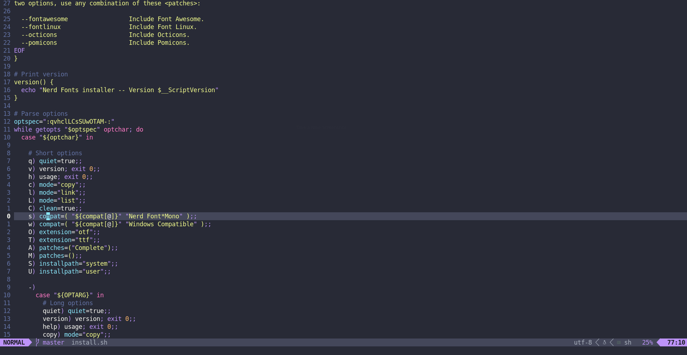

# NEOVIM



This is my configuration of [Neovim](https://neovim.io/). Why I use Neovim? Well, It is a fork of vim but supports configuration in Lua, Plugins written 
in lua, thus is more scalable. Indeed, Lua is faster than Viml, and It is a less of a pain to learn.I am still working on my configuration of neovim. It might take time. I will configure 
this build with nvim-cmp, Lsp, Autocompletion, Treesitter, possible bufferline, telescope(instead of fuzzyfinder), autopairs, lualine, and more to be added. I can 
guarantee you that this build will not be bloated. 

## Updates
-- I have successfuly setup this build with completion. Using nvim-cmp. 

## Downloading and Installing. 

1. You would have to install GNU `stow`, and `git` before proceeding. 
2. Downloading the repository with the help of [git](https://git-scm.com/).   
```bash
git clone git@github.com:dcodecraftz/neovim.git
```
3. Installing. 
[Stow](https://www.gnu.org/software/stow/) will symlink the configuration to the right location. 
```bash
stow */ -t $HOME
```
## Contributing. 
You can put out pull requests right now, but I will probaly only pull if You changes are promising. THANKS! 
