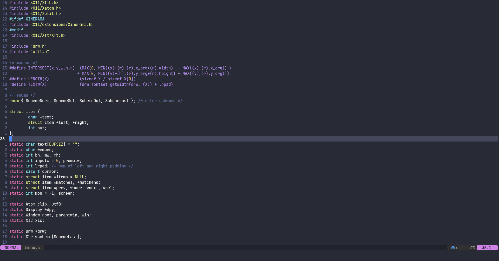

# NEOVIM



This is my configuration of [Neovim](https://neovim.io/). Why I use Neovim? It is a fork of [vim](https://www.vim.org/) but supports configuration in Lua, Plugins written 
in lua, thus is more scalable. Indeed, Lua is faster than Viml, and It is a less of a pain to learn.I am still working on my configuration of neovim. It might take time. I will configure 
this build with nvim-cmp, Lsp, Autocompletion, Treesitter, possibly bufferline, telescope, autopairs, lualine, Null.ls,  and more to be added. I can 
guarantee you that this build will not be bloated. 

## Plugins that come installed with my build: 
- Dracula.nvim
- popup.nvim
- nvim-cmp
- cmp-buffer
- cmp-path
- cmp-cmdline
- cmp-luasnip
- lualine
- nvim-web-devicons
- nvim-lspconfig
- Luasnip

## Downloading and Installing. 

1. You would have to install GNU `stow`, and `git` before proceeding. Additionally, You can install xsel to copy and paste into and outside of neovim.
2. Downloading the repository through [git](https://git-scm.com/).   
```bash
git clone https://github.com/dcodecraftz/neovim.git
```
3. Installing. 
[Stow](https://www.gnu.org/software/stow/) will symlink the configuration to the right location. 
```bash
stow */ -t $HOME
```
